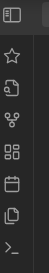
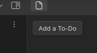
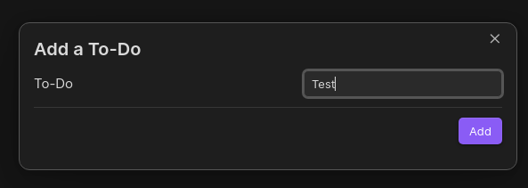
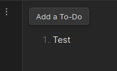

# What is this project all about?

I'm trying to create a simple To-Do plugin for Obsidian because why not. This is my first time trying to create a plugin to Obsidian and first real touch into TypeScript. I'm following the API documentation.

## API Documentation

See https://github.com/obsidianmd/obsidian-api

# The current status

I can add notes but can't mark them, delete them individually etc and they are not persistent.

Click on the star icon

Click on the button

Add a To-Do

# Things to add

1. Ability to delete/strikethrough todos
2. Data persistence
3. Whatever comes to mind...
